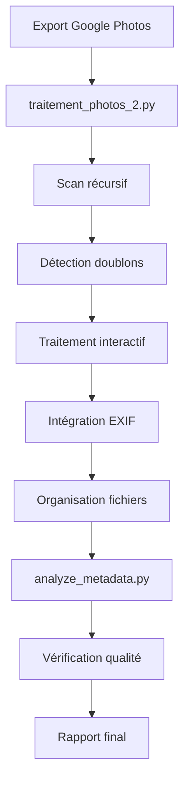

# Google Photos Processor Suite

Une solution complète en Python pour traiter et analyser vos photos et vidéos exportées de Google Photos, avec intégration complète des métadonnées JSON dans les fichiers EXIF.

## 🎯 Objectif

Cette suite d'outils automatise le traitement des exports Google Photos en deux étapes :
1. **Traitement principal** : Intégration des métadonnées et organisation des fichiers
2. **Analyse et vérification** : Contrôle qualité et validation des résultats

## � Composants

### 1. 🔧 Traitement Principal (`traitement_photos_2.py`)

Le script principal qui traite vos photos exportées de Google Photos.

#### Fonctionnalités principales :
- **Intégration EXIF complète** à partir des fichiers JSON
- **Gestion interactive des doublons** avec choix manuel
- **Préservation de l'organisation des dossiers**
- **Options de renommage flexibles**

#### Traitements effectués :
- **Données temporelles** : Date/heure de prise de vue
- **Géolocalisation** : Coordonnées GPS (latitude/longitude)
- **Informations descriptives** : Titre, description, mots-clés
- **Reconnaissance faciale** : Noms des personnes identifiées

#### Options de renommage :
- **Renommage optionnel** avec préfixe de date (YYYY-MM-DD)
- **Conservation** des noms originaux si souhaité
- **Nettoyage** des caractères spéciaux dans les noms
- **Troncature automatique** des noms trop longs

### 2. 📊 Analyse et Vérification (`analyze_metadata.py`)

Script d'analyse pour vérifier la qualité du traitement et valider les métadonnées.

#### Fonctionnalités d'analyse :
- **Scan récursif** de tous les sous-répertoires
- **Comptage automatique** des fichiers par type
- **Détection d'association** photo/vidéo ↔ JSON
- **Rapport détaillé** des fichiers avec/sans métadonnées
- **Vérification GPS** et géocodage optionnel
- **Statistiques complètes** de traitement

#### Vérifications effectuées :
- Présence des données EXIF de date/heure
- Validation des coordonnées GPS
- Contrôle des métadonnées intégrées
- Détection des fichiers problématiques

## 🗂️ Extensions Supportées

### Formats d'images
- **`.jpg`** / **`.jpeg`** : Images principales
- **`.json`** : Métadonnées associées

### Formats vidéo
- **`.mp4`** : Fichiers vidéo
- **`.jpg`** : Miniatures vidéo

### Types de fichiers JSON
- **`.supplemental-metadata.json`** : Métadonnées complètes des photos
- **`.sup.json`** : Métadonnées supplémentaires
- **`.mp4.supplemental-metadata.json`** : Métadonnées vidéo

## 🚀 Installation et Utilisation

### Prérequis
```bash
pip install -r requirements.txt
```

### Utilisation - Workflow complet

#### Étape 1 : Traitement principal
```bash
python traitement_photos_2.py
```

**Le script vous guidera à travers :**
1. 📁 **Scan récursif** des dossiers
2. 🔍 **Détection des doublons** (traitement interactif)
3. ⚙️ **Traitement principal** avec options de renommage
4. ✅ **Intégration EXIF** et organisation des fichiers

#### Étape 2 : Analyse et vérification
```bash
python analyze_metadata.py
```

**Options disponibles :**
- Analyse standard des métadonnées
- Vérification GPS avec géocodage optionnel
- Génération de rapports détaillés

### Workflow détaillé



## 📊 Fonctionnalités d'analyse

### Métriques collectées
- **Nombre total de fichiers** traités
- **Taux de couverture** des métadonnées
- **Fichiers avec données GPS** et géolocalisation
- **Erreurs** et fichiers problématiques
- **Statistiques** par type de fichier

### Rapports générés
- **Rapport de synthèse** avec statistiques globales
- **Liste détaillée** des fichiers traités
- **Identification** des fichiers sans métadonnées
- **Vérification GPS** et géocodage

## 📝 Exemples de sortie

### Traitement principal (traitement_photos_2.py)
```
📁 Analyse récursive du dossier : D:/SAuvegardephotos/GooglePhotos
✅ IMG_20231215_142830.jpg → 2023-12-15_IMG_20231215_142830.jpg
✅ Video_20231201_120000.mp4 → 2023-12-01_Video_20231201_120000.mp4
⚠️ Fichier sans JSON: photo_sans_metadata.jpg → copie simple

📊 Rapport final:
✅ 1,247 photos traitées avec métadonnées JSON
📁 23 photos copiées sans métadonnées
🎬 89 vidéos copiées avec miniatures
```

### Analyse et vérification (analyze_metadata.py)
```
📊 Analyse des métadonnées : D:/Sauvegardephotos/GooglePhotos2

📈 Statistiques globales:
- Total fichiers analysés: 1,359
- Fichiers JPEG/JPG: 1,270
- Fichiers MP4: 89
- Fichiers avec date EXIF: 1,247 (98.2%)
- Fichiers avec GPS: 892 (70.2%)
- Fichiers avec géolocalisation: 756 (84.7%)

⚠️ Fichiers nécessitant attention: 12
```

## 🔧 Configuration

### Répertoires par défaut
- **Source** : `D:/SAuvegardephotos/GooglePhotos`
- **Destination** : `D:/Sauvegardephotos/GooglePhotos2`
- Possibilité de personnaliser les chemins à l'exécution

### Options de renommage
```
Original  : IMG_20231215_142830.jpg
Avec renommage : 2023-12-15_IMG_20231215_142830.jpg
Sans renommage : IMG_20231215_142830.jpg
```

### Règles de nettoyage
- **Espaces** → remplacés par `_`
- **Longueur** → limitée à 30 caractères
- **Caractères spéciaux** → supprimés/remplacés

## 🗄️ Structure des métadonnées intégrées

### Informations temporelles
- **DateTimeOriginal** : Date/heure de prise de vue
- **DateTimeDigitized** : Date de numérisation
- **DateTime** : Date de modification

### Données de géolocalisation
- **GPSLatitude** / **GPSLongitude** : Coordonnées GPS
- **GPSLatitudeRef** / **GPSLongitudeRef** : Références N/S/E/W

### Informations descriptives
- **ImageDescription** : Description de l'image
- **XPTitle** : Titre de l'image
- **XPKeywords** : Noms des personnes identifiées

## � Fonctionnalités avancées

### Gestion des dates de fichiers
- **Modification automatique** des horodatages système
- **Support Windows** avec `pywin32` (optionnel)
- **Cohérence** entre métadonnées EXIF et dates système

### Robustesse
- **Gestion complète des erreurs** avec messages explicites
- **Validation des données JSON**
- **Préservation de la structure des dossiers**
- **Sauvegarde automatique** des fichiers originaux

## 🧪 Tests

Le dossier `test_PY/` contient des scripts de test pour :
- **Création de fichiers de test** avec métadonnées GPS
- **Validation des analyses** de géolocalisation
- **Tests unitaires** des fonctions principales

## 📄 Licence

Ce projet est sous licence MIT - voir le fichier [LICENSE](LICENSE) pour plus de détails.

## � Auteur

**Stephan Alluchon**  
*Développé pour automatiser le traitement des exports Google Photos*

## 🤝 Contribution

Les contributions sont les bienvenues ! N'hésitez pas à :
1. Fork le projet
2. Créer une branche pour votre fonctionnalité
3. Commiter vos changements
4. Pousser vers la branche
5. Ouvrir une Pull Request

## 📞 Support

Pour toute question ou problème, veuillez ouvrir une issue sur GitHub.

## 💡 Use Cases

✅ **Ideal for:**
- Long-term archiving of Google Photos
- Migration to other platforms/software
- Preserving metadata lost during exports
- Organization and cleanup of photo collections

⚠️ **Limitations:**
- Requires Google Photos JSON files
- Sequential processing (no parallelization)
- Dependent on Google Photos export structure

## 🤝 Contributing

Contributions are welcome! Feel free to:
- Report bugs
- Suggest improvements
- Add new features
- Improve documentation

## 📄 License

This project is licensed under the MIT License. See the `LICENSE` file for details.
